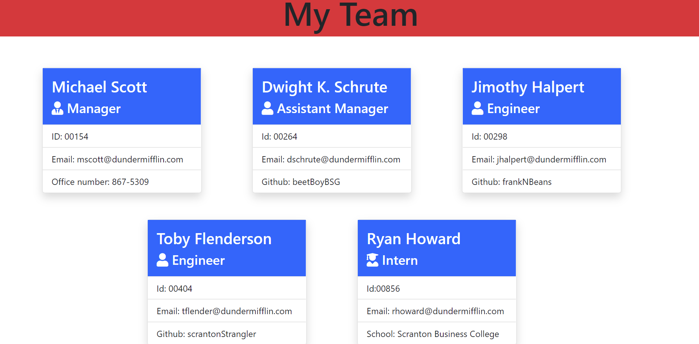

# Team Profile Generator

[](https://opensource.org/licenses/MIT)

## Description

This is a Node.js command-line application that takes in information about employees on a software engineering team, then generates an HTML webpage that displays summaries for each person.


## Table of Contents
* [Description](#description)
* [Installation](#installation)
* [Test](#test)
* [Walkthrough Video](#walkthroughvideo)
* [Screenshot](#screenshot)
* [License](#license)
* [Contributing](#contributing)
* [Badge](#badge)
* [Questions](#questions)


## Installation
To install, run the following command:
```
npm inquirer
```

## Test
To run tests, run the following command:
```
npm i jest
```

## Walkthrough Video


## Screenshot




## Contributing


## License
MIT
https://opensource.org/licenses/MIT


## Badge
[](https://github.com/ellerbrock/open-source-badges/)


## Questions
* If you have any questions or concerns, please contact me at https://github.com/ricapi96, or email me at enroquemore@gmail.com


                                      💙 Made by Erica Roquemore 💙